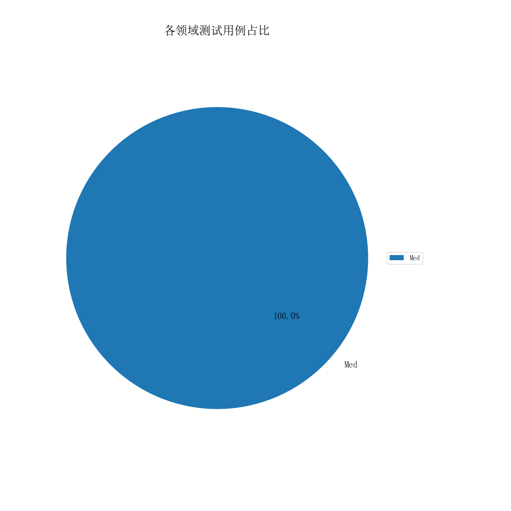
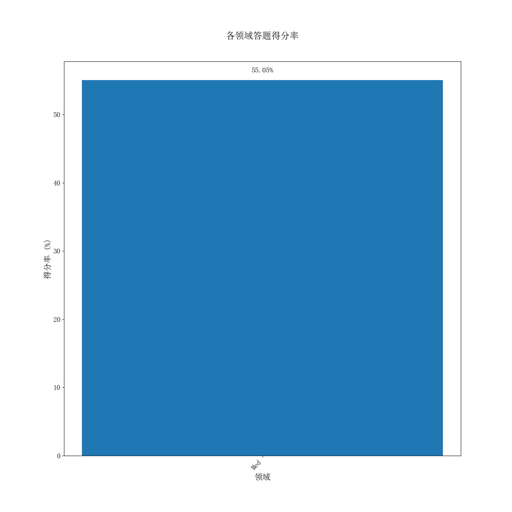

# 测试报告

## 背景介绍
这是一个对于场景化大语言模型的自动化测评报告。

由于工具中暂无关于当前大语言模型的背景信息，所以当前页仅展示本次测评中大语言模型答对的数条测试样例。

# 测试用例数据
本次测试包括218条测试用例.
这些测试用例主要包括"Med"领域
在所有测试用例中:

 “Med”领域中有218条测试用例。

在“Med”领域中 ,该大语言模型的得分为: 120.0/218。

在本次测试中，LLM的响应时间为：平均每条测试用例5.413秒

## 错误用例展示

对于以下这条属于"Med"领域的问题，该大语言模型的回答出现了错误。

问题：请在提供的选项中选择回答\n问题：““泻南补北”法适用于”\n选项："肾阴虚而肝阳亢","肾阴虚而相火动","心阴虚而心阳亢","肾阴虚而心火旺"

回答：“泻南补北”法适用于“肾阴虚而肝阳亢”。

该问题的正确答案应包含关键字：'肾阴虚而心火旺'。

对于以下这条属于"Med"领域的问题，该大语言模型的回答出现了错误。

问题：请在提供的选项中选择回答\n问题：“由于暑性升散，故致病可见”\n选项："易耗气伤津","易为阳热症状","易生风动血","易伤人体上部及肌表"

回答：易为阳热症状

该问题的正确答案应包含关键字：'易耗气伤津'。

对于以下这条属于"Med"领域的问题，该大语言模型的回答出现了错误。

问题：请在提供的选项中选择回答\n问题：““血之府”是指”\n选项："肝","脉","冲脉","心"

回答：根据中医理论，“血之府”是指“肝”。

该问题的正确答案应包含关键字：'脉'。

对于以下这条属于"Med"领域的问题，该大语言模型的回答出现了错误。

问题：请在提供的选项中选择回答\n问题：““大实有羸状”的病机应属于”\n选项："真虚假实","虚实夹杂","真实假虚","虚中夹实"

回答：根据中医理论，“大实有羸状”的病机应属于“虚实夹杂”。这种病机表示病人既有实证，又有虚证，需要综合治疗。

该问题的正确答案应包含关键字：'真实假虚'。

## 各领域答题得分率

